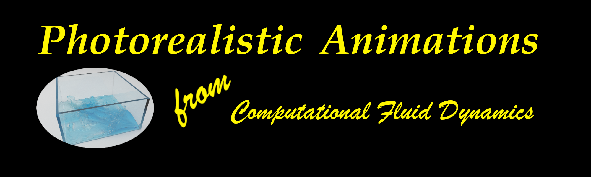

# scene_templates

This repository provides multiple templates to render CFD or other simulation results using [mitsuba v0.6.0]

# Tutorials

Detailed explanations to render CFD results and how to use this repository to kick-start rendering your results is made available. Please check these videos for:

## [YouTube videos](https://www.youtube.com/watch?v=35UEkzww5ds&list=PL14zCGMQYkUprMVMXT-4-J1AIFYPEQmy-&index=1)
  
  * Quick installation of utilities on Linux, Mac, Windows
  * Basic usage of git, docker, singularity
  * Detailed overview on using camera and lighting for photorealistic rendering
  * Multiple CFD results are considered

[mitsuba v0.6.0]: https://www.mitsuba-renderer.org/index_old.html